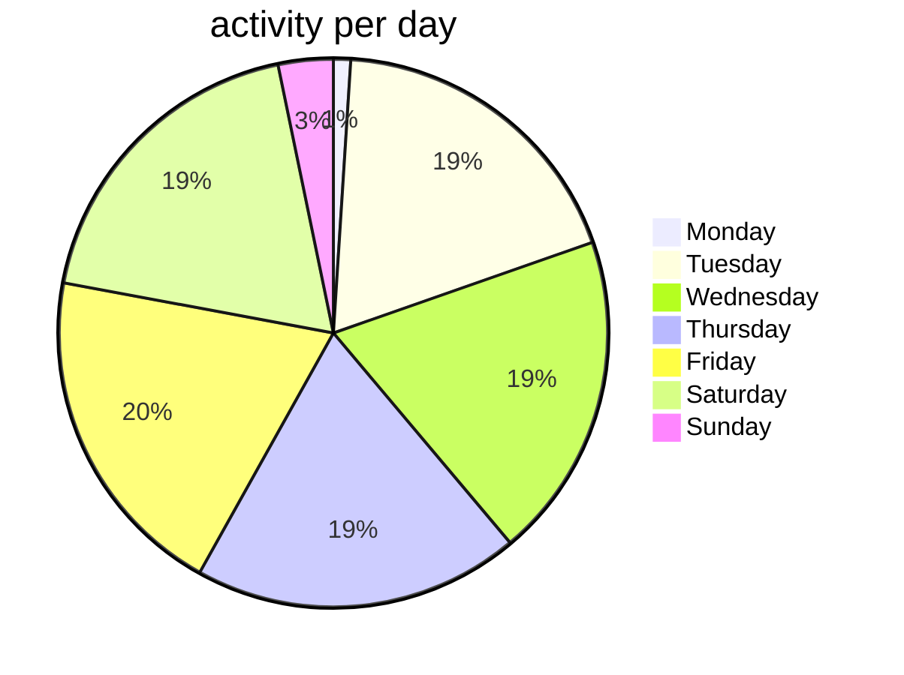

## dynamic rules for [OnlyFans DataScraper](https://github.com/DIGITALCRIMINALS/OnlyFans)
Credit to [Hippothon](https://github.com/hippothon) for reversing the algorithm.

Maintained by [DIGITALCRIMINALS](https://github.com/DIGITALCRIMINALS) and [OFFriend](https://github.com/OFFriend) (But mainly OFFriend since they provide automatic commits whenever the rules change)

## activity per day (based on 494 changes)
*Don't deploy on friday!* Guess who deploy most often on a friday. 

| Day        | Commits |
|------------|---------|
| Monday     | 5       |
| Tuesday    | 92      |
| Wednesday  | 95      |
| Thursday   | 95      |
| Friday     | 98      |
| Saturday   | 93      |
| Sunday     | 16      |
